# 2주차 과제

### Problem #1
Source Code
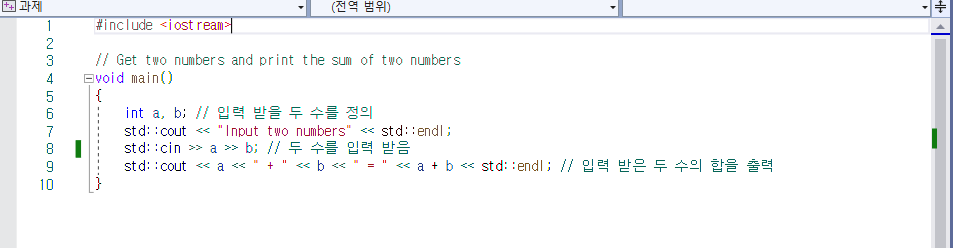

Output
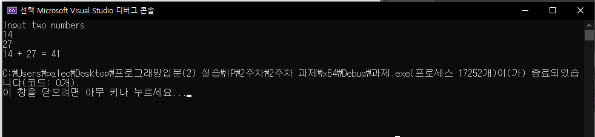

### Problem #2
Source Code
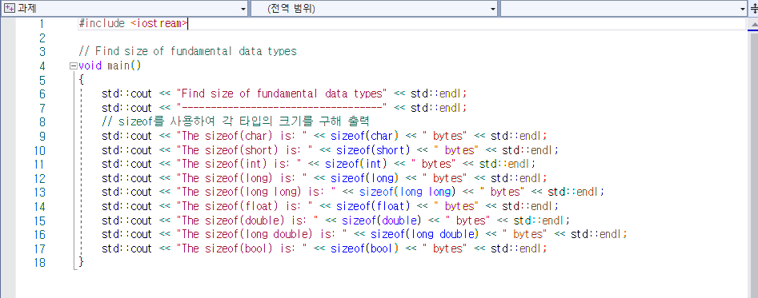

Output
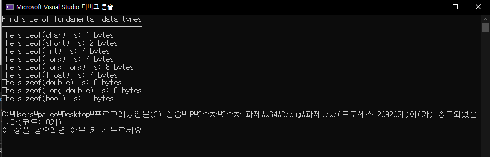

### Problem #3
Source Code
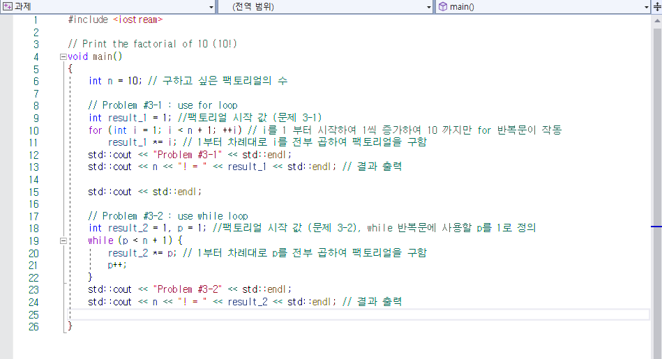

Output
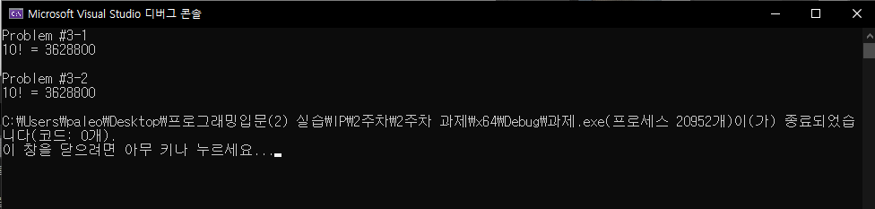

### Problem #4
Source Code
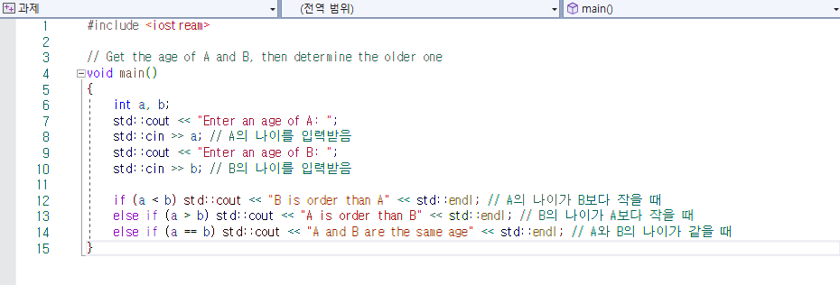

Output
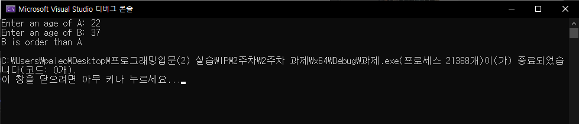
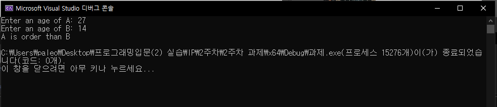
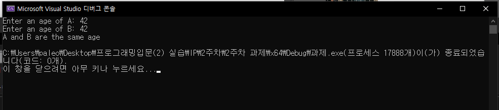

### Problem #5
Source Code
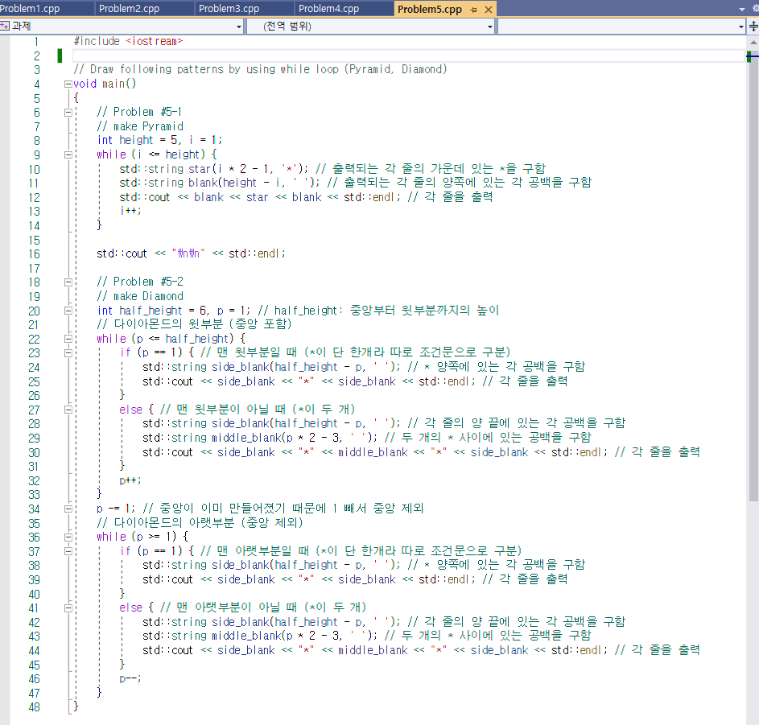

Output
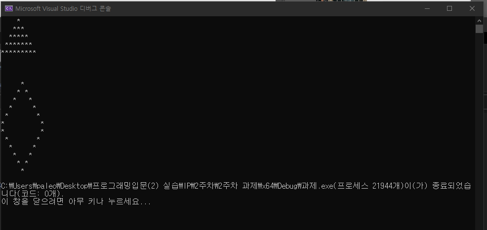
