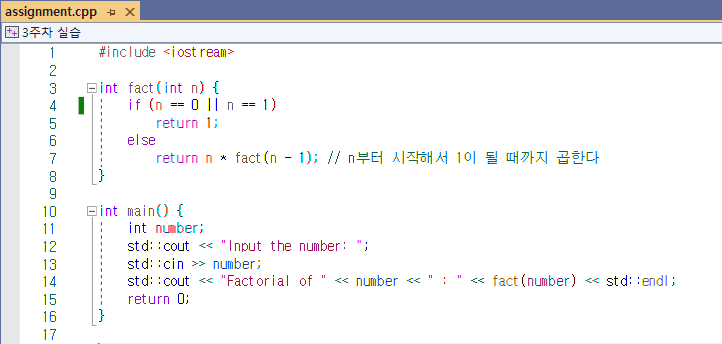
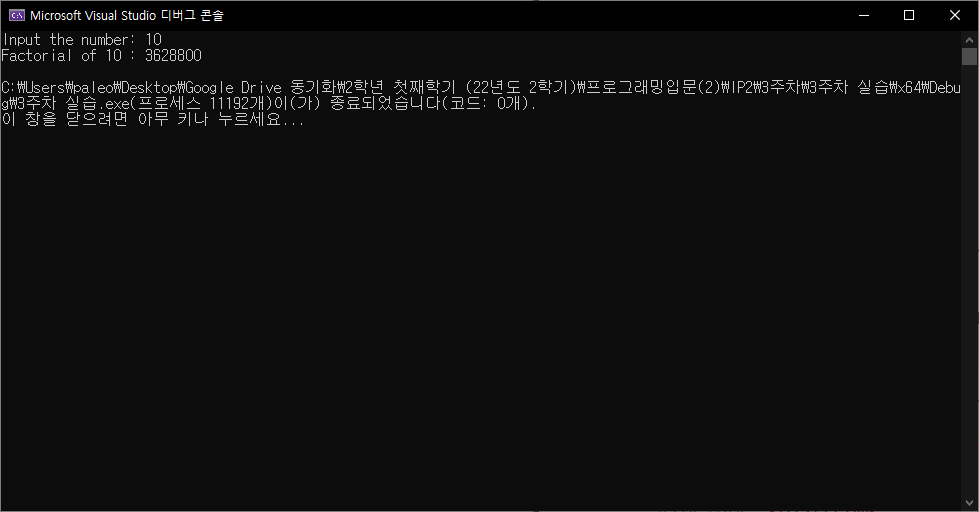

# 3주차 과제

**21101176학번 컴퓨터공학과 김채우**  

*설명은 각 소스코드의 주석으로 대체함*  
*각 문제의 Soure Code를 누르면 원본 소스코드로 이동함*  

## Problem #1
[Source Code](./3%EC%A3%BC%EC%B0%A8%20%EC%8B%A4%EC%8A%B5/3%EC%A3%BC%EC%B0%A8%20%EC%8B%A4%EC%8A%B5/assignment.cpp)
>

Output
>
